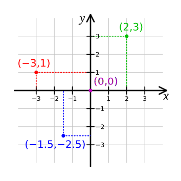
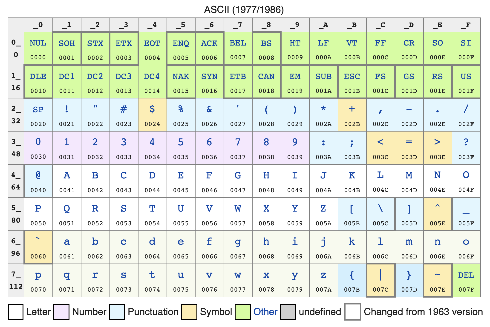
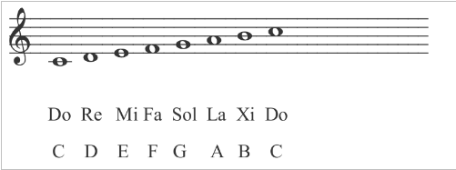
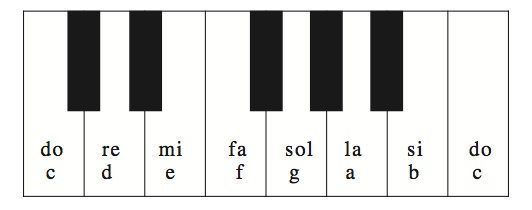
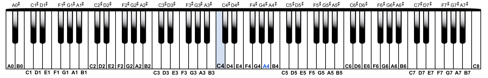
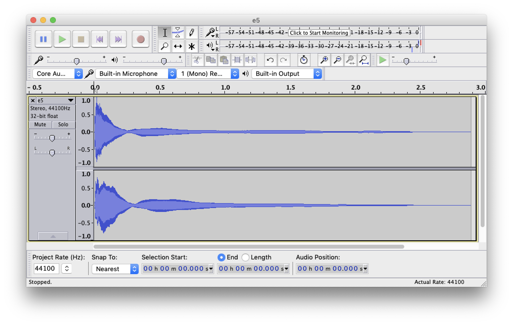

# Python Basics

Trước hết, bạn hãy đọc phần [bài học về Python](LESSON.vie.md).

Bây giờ, hãy clone Git repository về `Devel` repository của bạn:

```bash
$ cd ~/Devel
$ git clone https://github.com/open-institute-of-technology/sm_python-basics.git 
$ cd sm_python-basics
```

_Lưu ý: `<repository-name>` tương ứng với username của bạn mà không có các ký tự `<` và `>`._

Hãy tạo file `python_basics.py`. Bạn sẽ viết toàn bộ các hàm theo các yêu cầu trong nhiệm vụ dưới đây vào file này.

# Waypoint 1: Say Greeting

Viết hàm (function) `hello` nhận đối số (argument) bằng tham số (parameter) `name` (kiểu chuỗi - string). Hàm này trả kết quả là một chuỗi kết hợp bao gồm `'Hello '` nối với `name` và ký tự `'!'`.

Ví dụ:

```python
>>> hello('world')
'Hello world!'
>>> name = input('What is your name? ')
What is your name? LÝ Thành Phú!
>>> hello(name)
'Hello LÝ Thành Phú!'
```

Hãy chắc chắn rằng hàm của bạn [loại bỏ được toàn bộ khoảng trắng thừa phía trước và phía sau phần nội dung chính](https://docs.python.org/3.7/library/stdtypes.html#str.strip) của argument `name`.

Ví dụ:

```python
>>> hello('     Jack Carver')
'Hello Jack Carver!'
>>> hello('Jack Carver   ')
'Hello Jack Carver!'
>>> hello('   Jack Carver       ')
'Hello Jack Carver!'
```

# Waypoint 2: Định lý Pythagoras (Py-ta-go)

Viết hàm `calculate_hypotenuse` nhận đối số bằng 2 tham số `a` và `b` (kiểu integer hoặc float) lần lượt là chiều dài 2 cạnh của một [tam giác vuông](https://en.wikipedia.org/wiki/Right_triangle), và trả ra kết quả là chiều dài [cạnh huyền](https://en.wikipedia.org/wiki/Hypotenuse) của tam giác. Nhớ dùng [định lý Pythagoras](https://en.wikipedia.org/wiki/Pythagorean_theorem).

Ví dụ:

```python
>>> calculate_hypotenuse(1, 1)
1.4142135623730951
>>> calculate_hypotenuse(3, 4)
5.0
>>> calculate_hypotenuse(8, 10)
12.806248474865697
```

_Lưu ý: Để sử dụng chức năng tính căn bậc 2 [`sqrt`](https://docs.python.org/3.7/library/math.html#math.sqrt`) của Python, trong phần đầu file, bạn cần [import](https://docs.python.org/3/reference/simple_stmts.html#import) trước module [`math`](https://docs.python.org/3.7/library/math.htm) có sẵn trong thư viện Python Standard Library._

# Waypoint 3: Kiểm tra xem liệu tất cả Điều kiện (Conditions) đều Đúng (True)

Viết hàm `are_all_conditions_true` nhận đối số bằng tham số `conditions` (danh sách các dữ liệu kiểu boolean) và trả kết quả `True` nếu toàn bộ booleans trong danh sách đều `True`, nếu không thì trả kết quả `False`.

Nếu `conditions` là một list rỗng, hàm `are_all_conditions_true` sẽ trả kết quả `None`.

Ví dụ:

```python
>>> are_all_conditions_true([True, True, False, True, False, False, True])
False
>>> are_all_conditions_true([True, True, True])
True
>>> print(are_all_conditions_true([]))
None
```

# Waypoint 4: Kiểm tra xem liệu có ít nhất 1 điều kiện (Condition) là Đúng (True)

Viết hàm `is_a_condition_true` nhận đối số bằng tham số `conditions` (danh sách các dữ liệu kiểu boolean) và trả kết quả `True` nếu có ít nhất 1 boolean trong danh sách là `True`, nếu không thì trả kết quả `False`.

Nếu `conditions` là một list rỗng, hàm `is_a_condition_true` sẽ trả kết quả `None`.

Ví dụ:

```python
>>> is_a_condition_true([True, True, False, True, False, False, True])
True
>>> is_a_condition_true([True, True, True])
True
>>> is_a_condition_true([False, False])
False
>>> print(is_a_condition_true([]))
None
```

# Waypoint 5: Lọc danh sách các số nguyên

Viết hàm `filter_integers_greater_than` nhận 2 đối số bằng 2 tham số `l` (một danh sách các số nguyên) và `n` (một số nguyên), và trả kết quả là danh sách các số nguyên trích từ danh sách `l` và có giá trị lớn hơn `n`.

Ví dụ:

```python
>>> l = [0, 3, 5, -2, 9, 8]
>>> filter_integers_greater_than(l, 4)
[5, 9, 8]
>>> filter_integers_greater_than(l, 6)
[9, 8]
```

# Waypoint 6: Tìm các khách sạn có giá rẻ nhất

Viết hàm `find_cheapest_hotels` nhận 2 đối số bằng 2 tham số `hotel_daily_rates` và `maximum_daily_rate`, trong đó:

- `hotel_daily_rates`: là danh sách các khách sạn và giá thuê theo ngày tương ứng, có kiểu tuples `(hotel_name, daily_rate)`, trong đó:
  - `hotel_name`: là element (phần tử) đầu tiên của tuple, biểu thị tên của khách sạn, kiểu string;
  - `daily_rate`: là element thứ hai của tuple, thể hiện giá thuê theo ngày của khách sạn (đơn vị tính: USD), kiểu integer hoặc float.
- `maximum_daily_rate`: kiểu integer hoặc float, thể hiện giá thuê khách sạn theo ngày tối đa mà người dùng muốn trả.

Hàm trả kết quả là danh sách các khách sạn có giá thuê nhỏ hơn hoặc bằng giá trị của `maximum_daily_rate`. Danh sách các khách sạn được _[sorted (sắp xếp) theo thứ tự giá thuê tăng dần](https://docs.python.org/3/library/functions.html#sorted)_, tức là từ khách sạn có giá thuê rẻ nhất đến khách sạn có giá thuê cao nhất.

Ví dụ:

```python
>>> hotel_daily_rates = [
...    ('Majestic Saigon Hotel', 93),
...    ('Hotel Grand Saigon', 120),
...    ('Sofitel Saigon Plaza', 123),
...    ('Hotel Continental', 62),
...    ('Caravelle Hotel', 180),
...    ('Sheraton Saigon Hotel', 216),
...    ('Park Hyatt Saigon', 209)
... ]
>>> find_cheapest_hotels(hotel_daily_rates, 50)
[]
>>> find_cheapest_hotels(hotel_daily_rates, 85)
['Hotel Continental']
>>> find_cheapest_hotels(hotel_daily_rates, 150)
['Hotel Continental', 'Majestic Saigon Hotel', 'Hotel Grand Saigon', 'Sofitel Saigon Plaza']
```

# Waypoint 7: Tính khoảng cách giữa hai điểm trên một mặt phẳng

Viết hàm `calculate_euclidean_distance_between_2_points` nhận 2 đối số bằng 2 tham số `p1` và `p2`, biểu diễn 2 điểm trong một [hệ tọa độ Descartes](https://en.wikipedia.org/wiki/Cartesian_coordinate_system), và trả kết quả là [khoảng cách Euclid](https://en.wikipedia.org/wiki/Euclidean_distance) giữa `p1` và `p2`.



`p1` và `p2` được biểu diễn dưới dạng tuple bao gồm 2 phần tử kiểu integer hoặc float `(x, y)`, trong đó `x` tương ứng với vị trí trên trục tọa độ X (trục hoành), và `y` tương ứng với vị trí trên trục tọa độ Y (trục tung).

Ví dụ:

```python
>>> calculate_euclidean_distance_between_2_points((1, 2), (1, 2))
0.0
>>> calculate_euclidean_distance_between_2_points((0, 0), (3, 4))
5.0
>>> calculate_euclidean_distance_between_2_points((1, 1), (2, 2))
1.4142135623730951
```

# Waypoint 8: Tính khoảng cách giữa nhiều điểm trên một mặt phẳng

Viết hàm `calculate_euclidean_distance_between_points` nhận đối số bằng tham số `points`, là list (danh sách) các điểm trong một [hệ tọa độ Descartes](https://en.wikipedia.org/wiki/Cartesian_coordinate_system), và trả kết quả là tổng [khoảng cách Euclid](https://en.wikipedia.org/wiki/Euclidean_distance) giữa các điểm liên tiếp trong list.

Mỗi điểm trong list được biểu đạt bằng 1 tuple bao gồm 2 phần tử kiểu integer hoặc float `(x, y)` trong đó `x` tương ứng với vị trí trên trục tọa độ X (trục hoành), và `y` tương ứng với vị trí trên trục tọa độ Y (trục tung).

Hàm sẽ đưa ra (raise) [ngoại lệ `ValueError`](https://docs.python.org/3.7/library/exceptions.html#ValueError) nếu có ít hơn 2 điểm trong danh sách.

Ví dụ:

```python
>>> calculate_euclidean_distance_between_points([(0, 0), (3, 4)])
5.0
>>> calculate_euclidean_distance_between_points([(0, 0), (3, 4), (0, 0)])
10.0
>>> calculate_euclidean_distance_between_points([(0, 0), (3, 4), (-1, -1)])
11.403124237432849
>>> calculate_euclidean_distance_between_points([])
Traceback (most recent call last):
  File "<input>", line 1, in <module>
  File "<input>", line 4, in calculate_euclidean_distance_between_points
ValueError: The list MUST contain at least 2 points
>>> calculate_euclidean_distance_between_points([(1, 1)])
Traceback (most recent call last):
  File "<input>", line 1, in <module>
  File "<input>", line 4, in calculate_euclidean_distance_between_points
ValueError: The list MUST contain at least 2 points
```

_Lưu ý: INTEK khuyến khích bạn dùng lại hàm `calculate_euclidean_distance_between_2_points` mà bạn đã viết trong waypoint 7._

_Lưu ý: Bạn đã thử sử dụng [list comprehension](https://medium.com/better-programming/list-comprehension-in-python-8895a785550b) và hàm dựng sẵn [`sum`](https://docs.python.org/3.7/library/functions.html?#sum) chưa? Chúng có thể hữu ích đấy!_

# Waypoint 9: Viết hoa các chữ cái đầu trong một chuỗi

Viết hàm `capitalize_words` có tính năng như mô tả trong [epydoc documentation](http://epydoc.sourceforge.net/epytextintro.html) dưới đây:

```python
def capitalize_words(s):
    """Return a copy of the string with all the words capitalized.

    This function sets the first character in each word of the string `s`
    to uppercase and the rest to lowercase.

    The function removes any duplicate whitespace characters between
    words.

    If `None` is passed, the function returns `None`.

    @param s: a string that possibly contains words separated by whitespace
        characters.

    @return: a string where the first character in each word of the string
        `s`has been converted to uppercase and all remaining characters of
        this word have been converted to lowercase.

    @raise TypeError: if the argument `s` is not a string.
    """
```

Ví dụ:

```python
>>> capitalize_words('hello, word!')
'Hello, Word!'
>>> capitalize_words('JACK CARVER')
'Jack Carver'
>>> capitalize_words('   ')
''
>>> capitalize_words('Không  có gì    quý hơn  độc lập      tự do')
'Không Có Gì Quý Hơn Độc Lập Tự Do'
>>> print(capitalize_words(None))
None
>>> capitalize_words(69)
Traceback (most recent call last):
  File "<input>", line 1, in <module>
  File "<input>", line 23, in capitalize_words
TypeError: Not a string
```

_Lưu ý: Có lẽ bạn đang tự hỏi làm thế nào để chuyển đổi các ký tự thành chữ thường hay chữ hoa. Python cung cấp [khá nhiều hàm](https://docs.python.org/3/library/stdtypes.html#string-methods) giúp xử lý chuỗi. Bạn chỉ cần tìm xem các hàm nào phù hợp dùng trong waypoint này._

# Waypoint 10: Chữ hoa và chữ thường

Viết hàm `uppercase_lowercase_words` nhận đối số bằng tham số `s` (kiểu string) và trả kết quả là nội dung chuỗi trong đó các chữ được viết thường hoặc viết hoa tùy theo vị trí của chúng trong chuỗi, bắt đầu từ số thứ tự `0`:

- Các chữ ở vị trí có **thứ tự chẵn** được **viết hoa**;
- Các chữ ở vị trí có **thứ tự lẻ** được **viết thường**.

Chúng ta hãy cùng xem ví dụ sau: "`Lorem ipsum dolor sit amet`"

| Vị trí | Chữ       |
| ------ | --------- |
| 0      | "`Lorem`" |
| 1      | "`ipsum`" |
| 2      | "`dolor`" |
| 3      | "`sit`"   |
| 4      | "`amet`"  |

Hàm `uppercase_lowercase_words` sẽ trả ra kết quả sau: `"LOREM ipsum DOLOR sit AMET"`.

Hàm sẽ trả exception `TypeError` nếu `s` không phải string.

Vài ví dụ khác:

```python
>>> uppercase_lowercase_words('one two three four five')
'ONE two THREE four FIVE'
>>> uppercase_lowercase_words('SIX SEVEN EIGHT NINE TEN')
'SIX seven EIGHT nine TEN'
>>> uppercase_lowercase_words('1 one two 2 3 three four 4 five six')
'1 one TWO 2 3 three FOUR 4 FIVE six'
>>> upper_lower_words('   ')
''
>>> print(uppercase_lowercase_words(None))
None
>>> uppercase_lowercase_words(69)
Traceback (most recent call last):
  File "<input>", line 1, in <module>
  File "<input>", line 23, in uppercase_lowercase_words
TypeError: Not a string
```

# Waypoint 11: Giai thừa (Factorial)

Trong toán học, **factorial** hay giai thừa của một số nguyên dương `n`, ký hiệu `n!`, là tích của n số tự nhiên dương đầu tiên nhỏ hơn hoặc bằng `n`:

```text
n! = n × (n - 1) × (n - 2) × ... × 3 × 2 × 1
```

Ví dụ:

```text
5! = 5 × 4 × 3 × 2 × 1 = 120
```

Theo quy ước về [tích rỗng](https://en.wikipedia.org/wiki/Empty_product), giai thừa `0!` bằng `1`.

Hãy viết hàm `factorial` nhận đối số bằng tham số `n` (kiểu integer) và trả kết quả là giai thừa của `n`.

Hàm sẽ trả exception `TypeError` nếu `n` không phải số nguyên.

Hàm sẽ trả exception `ValueError` nếu `n` không phải số nguyên dương.

Ví dụ:

```python
>>> [(n, factorial(n)) for n in range(6)]
[(0, 1),
 (1, 1),
 (2, 2),
 (3, 6),
 (4, 24),
 (5, 120)]
>>> factorial('3')
Traceback (most recent call last):
  File "<input>", line 1, in <module>
  File "<input>", line 33, in factorial
TypeError: Not an integer
>>> factorial(-2)
Traceback (most recent call last):
  File "<input>", line 1, in <module>
  File "<input>", line 36, in factorial
ValueError: Not a positive integer
```

# Waypoint 12: Chuyển chữ số (ký tự số) thành số nguyên

Viết hàm `char_to_int` nhận đối số bằng tham số `c` là một chữ số, và trả kết quả là một số nguyên có giá trị bằng với giá trị được ghi bởi chữ số ban đầu.

Nếu `c` không phải string, hàm sẽ trả ra exception `TypeError`.

Nếu `c` là string nhưng chứa nhiều hơn 1 ký tự hoặc không phải [digit (chữ số)](https://docs.python.org/3/library/stdtypes.html?highlight=isdigit#str.isdigit), hàm sẽ trả ra exception `ValueError`.

Bạn **KHÔNG ĐƯỢC** dùng hàm dựng sẵn [int](https://docs.python.org/3/library/functions.html#int).

Ví dụ:

```python
>>> char_to_int('4')
4
>>> char_to_int(None)
Traceback (most recent call last):
  File "<input>", line 1, in <module>
  File "<input>", line 15, in char_to_int
TypeError: Not a string
>>> char_to_int(13.4)
Traceback (most recent call last):
  File "<input>", line 1, in <module>
  File "<input>", line 15, in char_to_int
TypeError: Not a string
>>> char_to_int('12')
Traceback (most recent call last):
  File "<input>", line 1, in <module>
  File "<input>", line 18, in char_to_int
ValueError: Not a single digit
```

_Gợi ý 1: Bạn có thể thử dùng hàm [ord](https://docs.python.org/3/library/functions.html#ord)._

_Gợi ý 2: Các ký tự mà bạn thấy hiển thị trên màn hình thực ra được ghi nhận theo số trong bộ nhớ của máy tính. Nói một cách đơn giản, các ký tự được sắp xếp theo thứ tự trong một *bảng mã ký tự*. Ví dụ, bảng mã ký tự [ASCII](https://en.wikipedia.org/wiki/ASCII) (1963) được thiết lập dựa theo bảng chữ cái dùng trong tiếng Anh. Bảng chữ cái này bao gồm các chữ số từ `0` đến `9`, các chữ cái thường từ `a` đến `z`, các chữ cái hoa từ `A` đến `Z` và các dấu chấm câu. Các chữ số trong bảng được sắp xếp theo thứ tự giá trị **tăng dần**, các chữ cái được sắp xếp theo thứ tự **chữ cái abc**. Mỗi ký tự trong bảng được gán một vị trí theo thứ tự. Ví dụ, vị trí theo thứ tự trong bảng của chữ cái "`A`" là `65`, còn dưới đây là thứ tự của các chữ số từ "`0`" đến "`9`":_

```python
>>> import string
>>> string.digits
'0123456789'
>>> [(d, ord(d)) for d in string.digits]
[('0', 48), ('1', 49), ('2', 50), ('3', 51), ('4', 52), ('5', 53), ('6', 54), ('7', 55), ('8', 56), ('9', 57)]
```



# Waypoint 13: Chuyển đổi chuỗi các chữ số thành số nguyên

Viết hàm `string_to_int` nhận đối số bằng tham số `s` là một chuỗi các chữ số, và trả kết quả là một số nguyên có giá trị bằng với giá trị được ghi bởi chuỗi các chữ số ban đầu.

Nếu `s` không phải string, hàm sẽ trả ra exception `TypeError`.

Nếu `s` là string nhưng có chứa ký tự không phải chữ số, hàm sẽ trả ra exception `ValueError`.

Bạn **PHẢI** sử dụng hàm `char_to_int` mà bạn đã viết trong waypoint trước.

```python
>>> string_to_int('17049171')
17049171
>>> string_to_int(None)
Traceback (most recent call last):
  File "<input>", line 1, in <module>
  File "<input>", line 19, in string_to_int
TypeError: Not a string
>>> string_to_int(1984)
Traceback (most recent call last):
  File "<input>", line 1, in <module>
  File "<input>", line 19, in string_to_int
TypeError: Not a string
>>> string_to_int('123abcd')
Traceback (most recent call last):
  File "<input>", line 1, in <module>
  File "<input>", line 22, in string_to_int
ValueError: Not a positive integer string expression
>>> string_to_int('-1234')
Traceback (most recent call last):
  File "<input>", line 1, in <module>
  File "<input>", line 22, in string_to_int
ValueError: Not a positive integer string expression
```

# Waypoint 14: Kiểm tra chuỗi Palindrome

Viết hàm `is_palindrome` nhận đối số bằng tham số `value` có kiểu dữ liệu bất kỳ và trả kết quả `True` nếu chuỗi trả ra là [palindrome](https://en.wikipedia.org/wiki/Palindrome), và trả kết quả `False` nếu không phải palindrome.

Hàm này chỉ giữ lại các chữ cái ([`string.ascii_letters`](https://docs.python.org/3.7/library/string.html#string.ascii_letters)) và chữ số ([`string.digits`](https://docs.python.org/3.7/library/string.html#string.digits)) trong bảng ASCII. Các ký tự khác không được tính.

Hàm này không có tính [case-sensitive](https://en.wikipedia.org/wiki/Case_sensitivity), tức là không phân biệt chữ hoa hay chữ thường.

Ví dụ:

```python
>>> is_palindrome('madam')
True
>>> is_palindrome('racecar')
True
>>> is_palindrome(10801)
True
>>> is_palindrome(1.947491)
True
>>> is_palindrome(1984)
False
>>> is_palindrome('Hello, world!')
False
>>> is_palindrome('A man, a plan, a canal, Panama!')
True
>>> is_palindrome('Was it a car or a cat I saw?')
True
>>> is_palindrome("No 'x' in Nixon")
True
```

# Waypoint 15: Chuyển đổi số La Mã sang số nguyên

## Giới thiệu về số La Mã

[Số La Mã](https://en.wikipedia.org/wiki/Roman_numerals) là [hệ thống chữ số có từ thời La Mã cổ đại](https://www.youtube.com/watch?v=49oWYxExWKE), trong đó các số được biểu thị thông qua việc kết hợp một số chữ cái trong hệ thống chữ La-tinh:

| Ký hiệu | Giá trị |
| ------- | ------- |
| `N`     | 0       |
| `I`     | 1       |
| `V`     | 5       |
| `X`     | 10      |
| `L`     | 50      |
| `C`     | 100     |
| `D`     | 500     |
| `M`     | 1,000   |

[Số La Mã](https://youtu.be/ByVrkHakTm0) thuộc hệ thập phân. Các phần ngàn (nghìn), trăm, chục và đơn vị được viết tách rời và theo thứ tự từ trái sang phải. Mỗi bậc lũy thừa của 10 được ký hiệu khác nhau, nhưng nguyên tắc dùng để ghi giá trị là giống nhau.

Các số trong bảng dưới đây được viết theo nguyên tắc "thêm":

| Đơn vị | Số La Mã      | Mô tả                                |
| ------ | ------------- | ------------------------------------ |
| 1      | `I`           |                                      |
| 2      | `II`          | `I` (1) + `I` (1)                    |
| 3      | `III`         | `I` (1) + `I` (1) + `I` (1)          |
| 5      | `V`           |                                      |
| 6      | `VI`          | `V` (5) + `I` (1)                    |
| 7      | `VII`         | `V` (5) + `I` (1) + `I` (1)          |
| 8      | `VIII`        | `V` (5) + `I` (1) + `I` (1)+ `I` (1) |
| 10     | `X`           |                                      |

Các số trong bảng dưới đây được viết theo nguyên tắc "giảm":

| Số La Mã      | Giá trị         | Mô tả                        |
| ------------- | --------------- | ---------------------------- |
| `IV`          | 4               | Giảm `I` (1) so với `V` (5)  |
| `IX`          | 9               | Giảm `I` (1) so với `X` (10) |

Các giá trị là bội số của 10, trong khoảng từ 10 đến 100, được viết theo cùng nguyên tắc, với `X`, `L`, và `C` lần lượt thay cho `I`, `V`, và `X`:

| Số La Mã      | Giá trị         | Nguyên tắc             |
| ------------- | --------------- | ---------------------- |
| `X`           | 10              |                        |
| `XX`          | 20              | Nguyên tắc "Thêm"      |
| `XXX`         | 30              | Nguyên tắc "Thêm"      |
| `XL`          | 40              | Nguyên tắc "Giảm"      |
| `L`           | 50              | Nguyên tắc "Thêm"      |
| `LX`          | 60              | Nguyên tắc "Thêm"      |
| `LXX`         | 70              | Nguyên tắc "Thêm"      |
| `LXXX`        | 80              | Nguyên tắc "Thêm"      |
| `XC`          | 90              | Nguyên tắc "Giảm"      |
| `C`           | 100             |

Tương tự, các giá trị là bội số của 100, trong khoảng từ 100 đến 1000, được viết như sau:

| Số La Mã      | Giá trị         |
| ------------- | --------------- |
| `C`           | 100             |
| `CC`          | 200             |
| `CCC`         | 300             |
| `CD`          | 400             |
| `D`           | 500             |
| `DC`          | 600             |
| `DCC`         | 700             |
| `DCCC`        | 800             |
| `CM`          | 900             |
| `M`           | 1000            |

Do hệ thống số La Mã không có ký hiệu quy định giá trị 5,000 và 10,000, các nguyên tắc ghi giá trị trên không thể biểu thị hết các giá trị là bội số của 1000 – kết quả là hệ thống số La Mã truyền thống chỉ ghi được các giá trị hàng ngàn cho 1,000, 2,000 và 3,000:

| Số La Mã      | Giá trị         |
| ------------- | --------------- |
| `M`           | 1000            |
| `MM`          | 2000            |
| `MMM`         | 3000            |

Như vậy, số lớn nhất có thể được biểu thị theo cách ghi giá trị trên là 3,999 (3,000 + 900 + 90 + 9 = `MMM` + `CM` + `XC` + `IX` = `MMMCMXCIX`).

## Dùng hàm Python để chuyển đổi số La Mã sang số nguyên

Viết hàm `roman_numeral_to_int` nhận đối số bằng tham số `roman_numeral` (kiểu string) và trả kết quả là một số nguyên có giá trị bằng với giá trị được ghi bởi số La Mã ban đầu.

Hàm trả ra exception `TypeError` nếu `roman_numeral` không phải string.

Hàm trả ra exception `ValueError` nếu `roman_numeral` là chuỗi rỗng hoặc có chứa ký tự không thuộc hệ thống chữ số La Mã.

Ví dụ:

```python
>>> roman_numeral_to_int('XXXIX')
39
>>> roman_numeral_to_int('CCXLVI')
246
>>> roman_numeral_to_int('DCCLXXXIX')
789
>>> roman_numeral_to_int('MMCDXXI')
2421
>>> roman_numeral_to_int('CLX')
160
>>> roman_numeral_to_int('CCVII')
207
>>> roman_numeral_to_int('MIX')
1009
>>> roman_numeral_to_int('MLXVI')
1066
>>> roman_numeral_to_int('MDCCLXXVI')
1776
>>> roman_numeral_to_int('MCMLIV')
1954
>>> roman_numeral_to_int('MMXIV')
2014
>>> roman_numeral_to_int('MMMCMXCIX')
3999
>>> roman_numeral_to_int(1234)
Traceback (most recent call last):
  File "<input>", line 1, in <module>
  File "<input>", line 3, in roman_numeral_to_int
TypeError: Not a string
>>> roman_numeral_to_int('XYZ')
Traceback (most recent call last):
  File "<input>", line 1, in <module>
  File "<input>", line 10, in roman_numeral_to_int
ValueError: Not a Roman numeral
```

_Lưu ý: Dù số La Mã trông có vẻ rối rắm, hàm trả giá trị cho chúng lại khá đơn giản. Nếu hàm của bạn đang có quá nhiều các câu lệnh `if`, có lẽ bạn đang phức tạp hóa vấn đề đấy._

_Gợi ý: Số La Mã được viết từ trái sang phải với các ký hiệu có giá trị giảm dần (nguyên tắc "thêm"); nếu một ký hiệu có giá trị lớn hơn ký hiệu liền trước nó, nguyên tắc "giảm" sẽ được áp dụng._

# Waypoint 16: Chơi một giai điệu

Bây giờ ta muốn chơi vài giai điệu thiếu nhi đơn giản như "Itsy Bitsy Spider", "Old McDonald Had A Farm", "Twinkle Twinkle Little Star", v.v.

## Vài khái niệm cơ bản trong âm nhạc

Một [**giai điệu**](https://en.wikipedia.org/wiki/Melody) là một chuỗi tuyến tính nối tiếp của các [**nốt nhạc**](https://en.wikipedia.org/wiki/Musical_note). Ví dụ, bản [Für Elise](https://en.wikipedia.org/wiki/F%C3%BCr_Elise) dành cho đàn dương cầm (độc tấu) là một trong [những sáng tác nổi tiếng nhất](https://www.youtube.com/watch?v=_mVW8tgGY_w) của nhạc sĩ Ludwig van Beethoven.

Tại đa số các nước, các nốt trong âm nhạc được ghi như sau `do`, `re`, `mi`, `fa`, `sol`, `la`, và `si`. Tuy nhiên trong tiếng Anh, các nốt thường được ký hiệu bằng [7 chữ cái đầu tiên trong hệ thống chữ cái La-tinh](https://www.youtube.com/watch?v=zvuNlN9WBYc) `A`, `B`, `C`, `D`, `E`, `F`, và `G`.

|                              |                             |
| ---------------------------- | --------------------------- |
|  |  |

Hiểu một cách đơn giản, các nốt được sắp xếp trong một [**quãng tám**](https://www.youtube.com/watch?v=fV-p9n7upMc). Trong âm nhạc, một [quãng tám là khoảng cách](https://en.wikipedia.org/wiki/Octave) giữa một cao độ âm thanh - một nốt với một nốt khác có tần số gấp đôi nó, tức tương đương với 8 nốt.

Theo quy định trong âm nhạc, các nốt cách nhau bởi một hay nhiều quãng tám được ký hiệu bằng cùng một chữ cái `A`, `B`, `C`, `D`, `E`, `F`, và `G`. Để phân biệt hai nốt ở hai quãng tám khác nhau, theo quy định ký âm quốc tế - [international pitch notation (IPN)](https://en.wikipedia.org/wiki/Scientific_pitch_notation), người ta sử dụng kết hợp chữ cái biểu thị nốt đó và một chữ số biểu thị cho quãng tám tương ứng. Ví dụ: `F2`, `B5`, `F6`, `D8`.



_Lưu ý: Các nốt trong cùng 1 quãng tám được sắp xếp theo thứ tự cao độ tăng dần như sau: `C`, `D`, `E`, `F`, `G`, `A`, `B`._

Trong âm nhạc, một [dấu hóa (accidental)](https://www.youtube.com/watch?v=r9JS_vZOGVg) dùng để chỉ nốt nhạc bị biến âm. Các dấu hóa thường dùng trong âm nhạc là dấu thăng - [**sharp** (♯)](<https://en.wikipedia.org/wiki/Sharp_(music)>) - cho biết nốt nhạc sẽ được chơi ở cao độ cao hơn nốt nhạc bình thường nửa cung, và dấu giáng - [**flat** (♭)](<https://en.wikipedia.org/wiki/Flat_(music)>) - cho biết nốt nhạc sẽ được chơi ở cao độ thấp hơn nốt nhạc bình thường nửa cung.

Dấu hóa được ghi ngay phía sau nốt nhạc. Ví dụ, F♯ nghĩa là F-thăng (F-sharp) và B♭ nghĩa là B-giáng (B-flat).

_Lưu ý: Để thuận tiện cho việc gõ các dấu hóa từ bàn phím máy tính, ta sẽ dùng ký tự `#` và `b` để biểu thị các dấu hóa thăng - **sharp** (♯) và giáng - **flat** (♭). Ví dụ: `E♭5` sẽ ghi thành `Eb5`, `F♯6` sẽ ghi thành `F#6`._

Trong Python, ta sẽ thể hiện một giai điệu theo kiểu tuple với các nốt được ghi kiểu string theo quy định ký âm quốc tế. Ví dụ, Für Elise được thể hiện dạng tuple như dưới đây:

```python
MELODY_FUR_ELISE = (
    'E5', 'Eb5', 'E5', 'Eb5', 'E5', 'B4', 'D5', 'C5', 'A4',
    'C4', 'E4', 'A4', 'B4',
    'E4', 'Ab4', 'B4', 'C5',
    'E4', 'E5', 'Eb5', 'E5', 'Eb5', 'E5', 'B4', 'D5', 'C5', 'A4',
    'C4', 'E4', 'A4', 'B4',
    'E4', 'C5', 'B4', 'A4',
    'E5', 'Eb5', 'E5', 'Eb5', 'E5', 'B4', 'D5', 'C5', 'A4',
    'C4', 'E4', 'A4', 'B4',
    'E4', 'Ab4', 'B4', 'C5',
    'E4', 'E5', 'Eb5', 'E5', 'Eb5', 'E5', 'B4', 'D5', 'C5', 'A4',
    'C4', 'E4', 'A4', 'B4',
    'E4', 'C5', 'B4', 'A4',
    'B4', 'C5', 'D5', 'E5',
    'G4', 'F5', 'E5', 'D5',
    'F4', 'E5', 'D5', 'C5',
    'E4', 'D5', 'C5', 'B4',
    'E4', 'E5',
    'E4', 'E5', 'Eb5', 'E5', 'Eb5', 'E5', 'Eb5', 'E5', 'Eb5', 'E5', 'Eb5', 'E5', 'Eb5', 'E5', 'B4', 'D5', 'C5', 'A4',
    'C4', 'E4', 'A4', 'B4',
    'E4', 'Ab4', 'B4', 'C5',
    'E4', 'E5', 'Eb5', 'E5', 'Eb5', 'E5', 'B4', 'D5', 'C5', 'A4',
    'C4', 'E4', 'A4', 'B4',
    'E4', 'C5', 'B4', 'A4',
)
```

## Chơi nhạc trong Python

Bây giờ ta sẽ viết code để chơi nhạc!

Có lẽ bạn đang tự hỏi làm thế nào để phát ra âm thanh trong Python. Việc này khá đơn giản! Ta sẽ dùng [`pygame`](https://www.pygame.org/), là một bộ các modules đa nền tảng trong Python được thiết kế để viết video games, bao gồm các thư viện về đồ họa và âm thanh.

Trước tiên, ta cần cài đặt thư viện này vào dự án của mình:

```bash
# Make sure that we are in our project's directory.
$ cd ~/Devel/intek-sm-python_basics
# Make sure that we have created a Python virtual environment.
$ pipenv shell --three
# Install pygame in our project.
$ pipenv install pygame
```

Sau đó, ta có thể dùng thư viện này để chơi đoạn âm thanh `duke_nukem_groovy.mp3` mà INTEK để sẵn trong Git repository của bạn.

Ta cần import module `pygame` và [khởi tạo (initialize) toàn bộ modules pygame đã imported](https://www.pygame.org/docs/ref/pygame.html?#pygame.init):

```python
>>> import pygame
pygame 1.9.6
Hello from the pygame community. https://www.pygame.org/contribute.html
>>> pygame.init()
(6, 0)
```

Giờ ta có thể [tải về file âm thanh](https://www.pygame.org/docs/ref/mixer.html#pygame.mixer.Sound) `duke_nukem_groovy.ogg` và [chơi thử](https://www.pygame.org/docs/ref/mixer.html#pygame.mixer.Sound.play):

```python
>>> sound = pygame.mixer.Sound('./duke_nukem_groovy.ogg')
>>> channel = sound.play()
```

Groovy!


## Công cụ chơi nhạc - Melody Player

Bạn sẽ tìm thấy trong thư mục `./sounds/piano` một bộ các files âm thanh có [đuôi mở rộng (extension) `.ogg`](https://en.wikipedia.org/wiki/Ogg). Mỗi file tương ứng với âm thanh phát ra của một nốt nhạc. Tên file tương ứng với tên nốt nhạc được ký âm theo hệ thống quốc tế. Ví dụ, file `eb5.ogg` tương ứng với nốt `E♭5`.

Hãy viết hàm `play_melody` nhận đối số bằng tham số `melody` và `sound_basedir`, trong đó:

- `melody`: Là tập hợp các nốt của giai điệu mà ta muốn chơi, các nốt này có tính lặp - [iterable](https://hackernoon.com/how-iterables-actually-work-in-python-65c36ff91c1e), và được biểu thị theo quy định ký âm quốc tế;
- `sound_basedir`: là chuỗi thể hiện đường dẫn đến thư mục chứa các files âm thanh của các nốt nhạc. Hàm `play_melody` sẽ dùng tham số (parameter) này để tìm và tải các files âm thanh tương ứng.

Hàm này sẽ liên tục chơi các nốt nhạc trong giai điệu theo tốc độ mà bạn quy định. Gợi ý là bạn nên chơi mỗi nốt trong 400ms, tuy nhiên cũng tùy ý bạn nhé.

Hàm sẽ trả về một danh sách các đường dẫn của các nốt đã được chơi lần lượt theo thứ tự.

Ví dụ:

```python
>>> MELODY_I_LOVE_YOU = [
...     'G3', 'E3', 'G3', 'G3', 'E3', 'G3',
...     'A3', 'G3', 'F3', 'E3', 'D3', 'E3', 'F3',
...     'E3', 'F3', 'G3', 'C3', 'C3', 'C3', 'C3', 'C3', 'D3', 'E3', 'F3', 'G3',
...     'G3', 'D3', 'D3', 'F3', 'E3', 'D3', 'C3',
...     'G3', 'E3', 'G3', 'G3', 'E3', 'G3',
...     'A3', 'G3', 'F3', 'E3', 'D3', 'E3', 'F3',
...     'E3', 'F3', 'G3', 'C3', 'C3', 'C3', 'C3', 'C3', 'D3', 'E3', 'F3', 'G3',
...     'G3', 'D3', 'D3', 'F3', 'E3', 'D3', 'C3',
... ]
>>> play_melody(MELODY_I_LOVE_YOU, './sounds/piano')
['./sounds/piano/G3.ogg',
 './sounds/piano/E3.ogg',
 './sounds/piano/G3.ogg',
 './sounds/piano/G3.ogg',
 ...
 './sounds/piano/F3.ogg',
 './sounds/piano/E3.ogg',
 './sounds/piano/D3.ogg',
 './sounds/piano/C3.ogg']
```

_Lưu ý: Hàm của bạn có lẽ sẽ chơi được vài nốt, rồi... im lặng. Đó là do `pygame` chỉ hỗ trợ mặc định 8 channels, tức là chỉ chơi được 8 nốt trong một lượt._

_Bạn nghĩ là bạn đang cho chơi lần lượt hết nốt này rồi đến nốt khác, nhưng thực tế code của bạn có thể lại phát một nốt mới trong khi nốt trước vẫn chưa phát xong. Nếu xem kỹ lại các files `.ogg`, bạn sẽ thấy tổng thời gian của một nốt kéo dài đến vài giây._



_Nếu đoạn code của bạn chơi một nốt nhạc, rồi chờ 400ms và phát nốt tiếp theo, thực chất là nó đang phát 2 nốt một lượt. Đoạn code đó có lẽ đang cố phát nhiều hơn 8 nốt một lúc, tức là nhiều hơn số lượng âm tối đa mà `pygame` có thể chơi cùng lúc trong một lần._

_Để giải quyết vấn đề này, ta cần yêu cầu `pygame` [dừng](https://www.pygame.org/docs/ref/mixer.html#pygame.mixer.Sound.stop) chơi một nốt nhạc [sau](https://www.pygame.org/docs/ref/time.html?highlight=delay#pygame.time.delay) 400ms, hoặc yêu cầu `pygame` [phát một nốt nhạc rồi dừng](https://www.pygame.org/docs/ref/mixer.html#pygame.mixer.Sound.play) sau 400ms._

## Cải tiến Melody Player

Có lẽ bạn đã nhận ra thư mục `./sounds/piano` không có các nốt nhạc với dấu **thăng** (♯), mà chỉ có các nốt với dấu **giáng** (♭).

Ta đã biết nốt có dấu **thăng** (♯) sẽ được chơi cao hơn nửa cung, còn nốt có dấu **giáng** (♭) được chơi thấp hơn nửa cung. Điều này nghĩa là một nốt nhạc mang dấu **thăng** sẽ tương đương với nốt nhạc tiếp sau nó mà có mang dấu **giáng**. Ví dụ, `F♯4` tương đương với `G♭4`.

Ta muốn chơi bài [_Happy Birthday to You_](https://youtu.be/w46_xPKgPHE?t=5) nhưng bản ký âm giai điệu mà ta đang có lại là bản dùng dấu **thăng** (♯):

```python
MELODY_HAPPY_BIRTHDAY_TO_YOU = (
    'C4', 'C4', 'D4', 'C4', 'F4', 'E4',
    'C4', 'C4', 'D4', 'C4', 'G4', 'F4',
    'C4', 'C4', 'C5', 'A4', 'F4', 'E4', 'D4',
    'A#4', 'A#4', 'A4', 'F4', 'G4', 'F4',
)
```

Phiên bản hàm `play_melody` ta hiện có sẽ không chơi được giai điệu trên, vì nó không tìm được files có nốt mang dấu **thăng** (♯). Nó có thể sẽ trả ra exception sau:

```python
>>> play_melody(MELODY_HAPPY_BIRTHDAY_TO_YOU, './sounds/piano')
Traceback (most recent call last):
  File "<input>", line 1, in <module>
  File "<input>", line 18, in play_melody
KeyError: 'a#4'
```

Để hàm `play_melody` có thể chơi được giai điệu trên, hãy cập nhật hàm `play_melody` sao cho các nốt mang dấu **thăng** (♯) được thay thành các nốt tương đương với dấu **giáng** (♭).

Hàm sẽ trả về một danh sách các đường dẫn đến các nốt đã được phát lần lượt theo thứ tự, trong đó các nốt mang dấu **thăng** (♯) đã được thay thế bằng các nốt mang dấu **giáng** (♭) tương ứng.

Ví dụ:

```python
MELODY_HAPPY_BIRTHDAY_TO_YOU = (
    'C4', 'C4', 'D4', 'C4', 'F4', 'E4',
    'C4', 'C4', 'D4', 'C4', 'G4', 'F4',
    'C4', 'C4', 'C5', 'A4', 'F4', 'E4', 'D4',
    'A#4', 'A#4', 'A4', 'F4', 'G4', 'F4',
)
>>> play_melody(MELODY_HAPPY_BIRTHDAY_TO_YOU, './sounds/piano')
['./sounds/piano/c4.ogg',
 './sounds/piano/c4.ogg',
 './sounds/piano/d4.ogg',
 ...
 './sounds/piano/bb4.ogg',
 './sounds/piano/bb4.ogg',
 ...
 './sounds/piano/f4.ogg',
 './sounds/piano/g4.ogg',
 './sounds/piano/f4.ogg']
```

_Gợi ý: Nếu bạn không biết làm thế nào để chuyển đổi giữa chuỗi các nốt mang dấu **giáng** (♭) với chuỗi các nốt mang dấu **thăng** (♯), bạn nên xem lại cách dùng [Python strings](https://www.digitalocean.com/community/tutorials/how-to-index-and-slice-strings-in-python-3) và [Python lists](https://www.digitalocean.com/community/tutorials/how-to-use-list-methods-in-python-3)._
